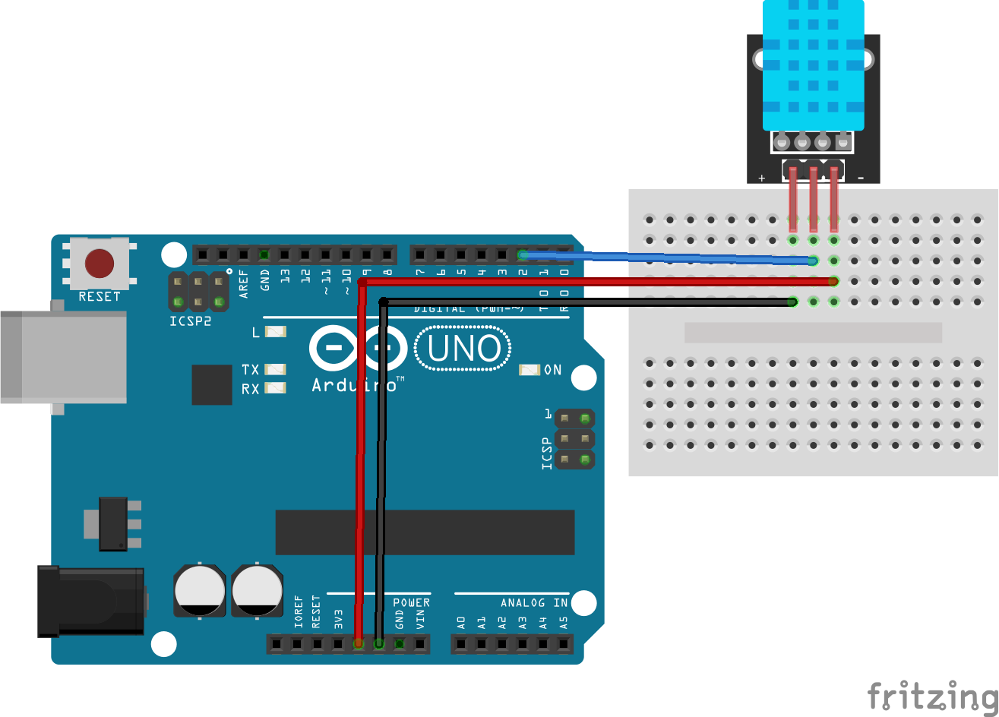

# Arduino UNO <> DHT11 temperature sensor Rust project

This is a small project that uses Rust to read data from a DHT11 temperature sensor connected to an Arduino UNO. The project is designed to be simple and easy to understand, making it a great starting point for anyone interested in using Rust with Arduino.

## Dependencies

- [avr-hal](https://github.com/Rahix/avr-hal): Rust crates and utilities to interface with Arduino (AVR microctrollers more generally)
- [dht11-rs](https://github.com/plorefice/dht11-rs): Rust driver for DHT11 sensor

## Usage

If you are already familiar with avr-hal, the project is plug-and-play. You can run it out of the box by launching:

```bash
$ cargo run
```

## Wiring


